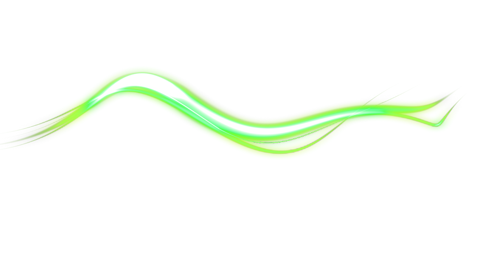

<h1 align="center">Hey, I'm <a href="https://github.com/MaxGras">MaxGras (Maxim)</a> 👨‍💻</h1>

  Frontend-Focused Full-Stack Engineer | JavaScript & TypeScript Enthusiast

|                                                                                          |                                                                              |
| ---------------------------------------------------------------------------------------- | ---------------------------------------------------------------------------- |
|                             | Architecting modern web apps with <strong>React, NestJS, TypeScript</strong> |
|                           | Bridging frontend elegance with backend performance                          |
|  | Building intuitive UIs, scalable APIs, and developer-friendly tools          |

  

---

### 🧰 Core Stack: RNTS (React – NestJS – TypeScript – Supabase)

  <code>React ⚛️</code> | <code>NestJS 🚀</code> | <code>TypeScript 🦕</code> | <code>Supabase 🧩</code>  
  

---

### 🛠️ My Tech Toolbox

  <!-- Row 1: 4 icons -->
  
   

  <!-- Row 2: 6 icons -->
  
   

  <!-- Row 3: 8 icons -->
  
   

  <!-- Row 4: 8 icons -->
  
   

  <!-- Row 5: 6 icons -->
  
   

  <!-- Row 6: 4 icons -->
  

---

 

